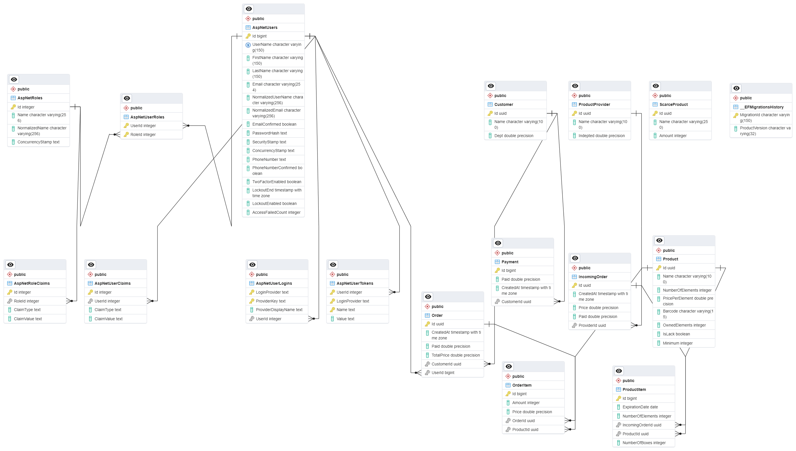

# Pharma
Pharmacy Management System built with $\bold{.NET\ 8}\ Web\ API$ following $\bold{Onion\ Architecture}$.

## Project Overview
This project is concerned with managing pharmacy from financial prespective, starting from product providers and the incoming orders at which products enter the system, followed by the storage and ends with orders and customers.
#### Note: this project following DB-first approach, so for those who may want to run it locally, you may need to delete the migrations, create your own and then update your database.

## Database Design
The following ERD describes the database design

## Project Structure
This project is built following 4-Layered Onion Architecture

### Domain Layer (Core)
This layer contains the business models of the system along with the interfaces for repositories and unit of work.

### Application Layer
This layer contains the workflow of the proejct such as interfaces for services, Data transfer objects, Mappers from models to DTOs and vice versa, generic responses for dealing with errors and finally the services implementation.

### Infrastructure Layer
This layer concerned with dealing with outside world, like dealing with database, containing configurations, DBContext and the implementation of the interfaces in Domain layer.

### Presentation Layer (API)
This layer contains the application endpoints and the configuration for web app and service collections like dependency injection, authentication, authorization, cookie config and so on.
